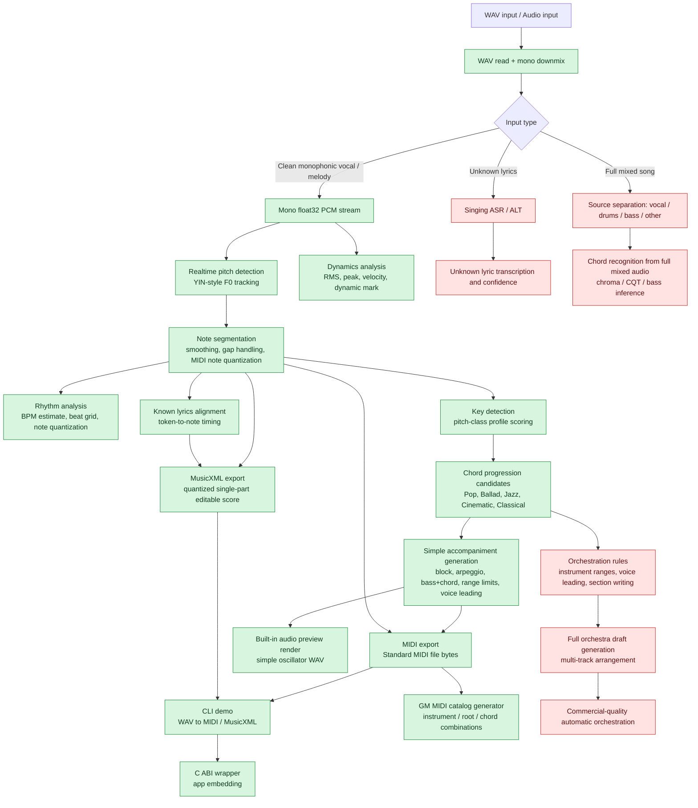

# Algorithm Flow Status

Legend:

- Completed: implemented in the native C++ core and covered by tests.
- Partial: implemented as a deterministic MVP, but not production-complete for all musical cases.
- Not started: requires additional model integration, datasets, or a later product decision.

## Completed Native Core

- Realtime monophonic pitch detection: `include/music_elf/pitch_detector.hpp`
- Note segmentation: `include/music_elf/note_segmenter.hpp`
- Rhythm quantization: `include/music_elf/rhythm_analyzer.hpp`
- Note dynamics: `include/music_elf/dynamics_analyzer.hpp`
- Known lyrics alignment: `include/music_elf/lyric_aligner.hpp`
- Key detection and chord candidates: `include/music_elf/harmony_analyzer.hpp`
- Simple accompaniment generation: `include/music_elf/accompaniment_generator.hpp`
- WAV I/O and mono downmix: `include/music_elf/audio_io.hpp`
- Built-in note audio preview renderer: `include/music_elf/audio_renderer.hpp`
- End-to-end pipeline runner: `include/music_elf/core_pipeline.hpp`
- MIDI export: `include/music_elf/midi_writer.hpp`
- General MIDI catalog generator: `include/music_elf/midi_catalog.hpp`
- Quantized single-part MusicXML export with measures, rests, ties, lyrics, key, time, and clef: `include/music_elf/musicxml_writer.hpp`
- CLI demo, inspect, benchmark, catalog, and render-preview helpers: `tools/music_elf_cli.cpp`
- C ABI wrapper with pitch, pipeline summary, MIDI export, and MusicXML export helpers: `include/music_elf/c_api.h`
- Model-backed feature interfaces: `include/music_elf/model_interfaces.hpp`
- Model integration data contracts: `docs/model_integration_schemas.md`

## Not Completed Yet

- Source separation for full songs.
- Unknown lyric transcription / singing ASR.
- Full-song chord recognition from mixed audio.
- Neural audio-to-MIDI models such as Basic Pitch / CREPE-style model inference.
- Full orchestration rules and multi-track orchestra generation.
- Commercial-quality automatic orchestration.
