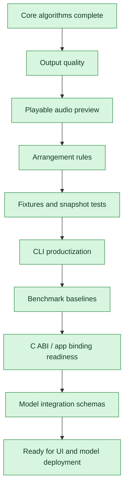

# Pre-UI / Pre-AI Model Roadmap

This roadmap tracks product-core work that can be completed before UI integration
and external AI model deployment.

## Progress Flow

## Execution Plan

| Order | Work item | Status | Acceptance |
|---:|---|---|---|
| 1 | MIDI output quality: tempo, track name, time signature, key signature, program change | Done | MIDI tests verify meta events |
| 2 | Built-in lightweight audio preview renderer | Done | Generated notes can render to PCM/WAV without external synth |
| 3 | CLI command for render-demo / audio preview | Done | CLI writes a WAV preview and tests verify RIFF output |
| 4 | Arrangement rules: inversions, bass + chord patterns, range constraints | Done | Tests cover note ranges and smoother chord movement |
| 5 | Fixtures and snapshot tests | Done | Stable synthetic fixtures produce deterministic MIDI/MusicXML |
| 6 | CLI productization: inspect, benchmark, render helpers | Done | CTest covers CLI smoke and e2e workflows |
| 7 | Benchmark baselines | Done | Runtime summaries are emitted and tracked by tests/tools |
| 8 | C ABI pipeline expansion | Done | C API can run pipeline-level analysis/export |
| 9 | Model integration schemas | Done | Source separation, ASR, and neural MIDI schemas are documented |
