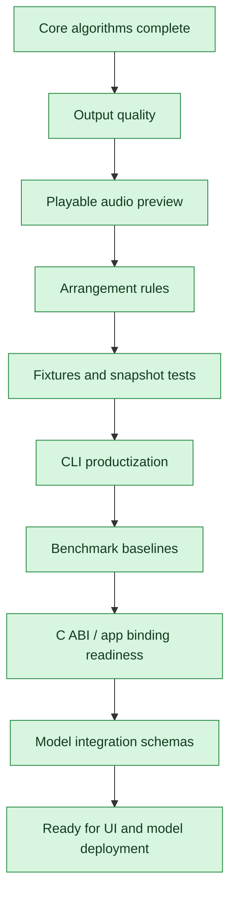

# Pre-UI / Pre-AI Model Roadmap

This roadmap tracks product-core work that can be completed before UI integration
and external AI model deployment.

## Progress Flow

## Execution Plan

| Order | Work item | Status | Acceptance |
|---:|---|---|---|
| 1 | MIDI output quality: tempo, track name, time signature, key signature, program change | Done | MIDI tests verify meta events |
| 2 | Built-in lightweight audio preview renderer | Done | Generated notes can render to PCM/WAV without external synth |
| 3 | CLI command for render-demo / vocal-band audio preview | Done | CLI writes a WAV preview that merges the original vocal with the rendered arrangement |
| 4 | Arrangement rules: inversions, bass + chord patterns, range constraints | Done | Tests cover note ranges and smoother chord movement |
| 5 | Fixtures and snapshot tests | Done | Stable synthetic fixtures produce deterministic MIDI/MusicXML |
| 6 | CLI productization: inspect, benchmark, render helpers | Done | CTest covers CLI smoke and e2e workflows |
| 7 | Benchmark baselines | Done | Runtime summaries are emitted and tracked by tests/tools |
| 8 | C ABI pipeline expansion | Done | C API can run pipeline-level analysis/export |
| 9 | Model integration schemas | Done | Source separation, ASR, and neural MIDI schemas are documented |

## Current Non-AI Status

| Area | Status | Notes |
|---|---|---|
| Deterministic native core | Done | Clean monophonic vocal or single-melody input can flow through pitch, notes, rhythm, dynamics, harmony, accompaniment, MIDI, MusicXML, and opt-in preview rendering with vocal-band mixing. |
| Synthetic and snapshot test coverage | Done | Core algorithms, export bytes/text, CLI smoke tests, C API behavior, and model-boundary status are covered by CTest. |
| Real a cappella fixture coverage | Done | Seven real vocal fixtures run through audio I/O, pitch, notes, rhythm, dynamics, harmony, lyrics alignment, export, pipeline, and opt-in preview rendering with persisted audit artifacts including pitch-stability baselines. |
| CLI user workflows | Done | Default WAV export, inspect, benchmark, render-preview, render-demo, generate-catalog, and help flows are implemented. |
| C ABI app readiness | Done | Native calls are available for pitch, pipeline summary, MIDI export, MusicXML export, and vocal-band WAV export. |
| Conductor Studio frontend demo | Partial | A standalone docs/demo React surface exists, but it is not a production app bundle or native binding. |
| Production app shell | Not started | Planned as Flutter desktop/mobile with an FFI facade; the app should call native bindings rather than parse CLI output. |
| Parameter and history storage | Not started | Presets, catalog metadata, user settings, and analysis history still need a schema and migration path. |
| Release packaging and CI artifacts | Not started | Cross-platform build, test, packaging, and sample-output artifacts need a formal pipeline. |

## Next Non-AI Planning Table

| Priority | Work item | Status | Acceptance |
|---:|---|---|---|
| 1 | Real-vocal quality tuning | In progress | Fixture reports track pitch stability, note counts, BPM, detected key, and export size before and after each tuning change. |
| 2 | Rule-based arrangement expansion | Ready | Additional accompaniment styles, bass movement, cadences, range rules, and smoother voice leading are covered by deterministic tests. |
| 3 | Export polish | Ready | MusicXML and MIDI output handle pickup measures, tempo/key/time overrides, rests, ties, chord symbols, and DAW/notation-app smoke checks. |
| 4 | CLI batch and preset workflow | Ready | CLI can process folders, load/save JSON configs, choose presets, write structured summaries, and fail with actionable messages. |
| 5 | Flutter app shell and FFI facade | Planned | Import/record, analyze, inspect, edit, preview, and export screens call the C ABI through a typed facade. |
| 6 | Parameter and data layer | Planned | Presets, analysis history, catalog metadata, and user-editable settings have JSON import/export plus a local database migration plan. |
| 7 | Localization pass | Planned | zh-TW and English strings cover UI labels, musical terms, warnings, export labels, and provider-status text without hard-coded product copy. |
| 8 | CI and release packaging | Planned | Windows, macOS, and Linux builds run CTest and publish CLI/library/sample-output artifacts. |
| 9 | Documentation cleanup | Planned | README and docs clearly state the clean-monophonic MVP boundary, setup commands, CLI examples, output artifacts, and non-AI versus model-backed scope. |
